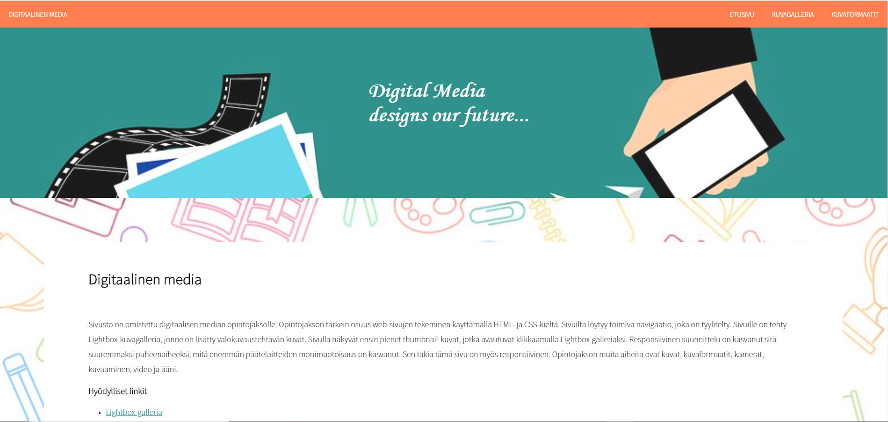
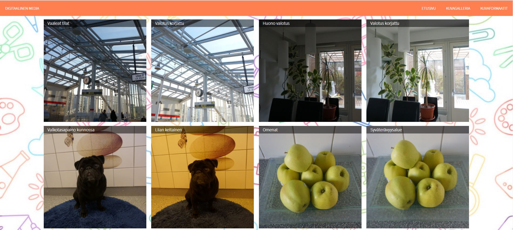
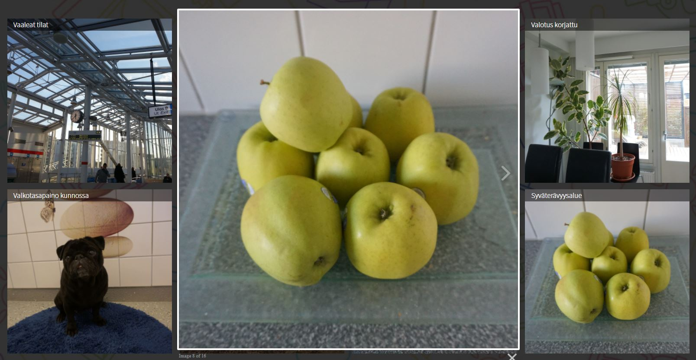

# practice-website
The purpose of this website was to practise making a website.
The website was made using HTML, CSS and JavaScript.
The website includes a lightbox gallery and it has a responsive navigation bar.

## Website Images
Screenshots below illustrate views of the website.

### Main Page

### Image Gallery

### Lightbox Gallery

### Responsive Navigation Bar
